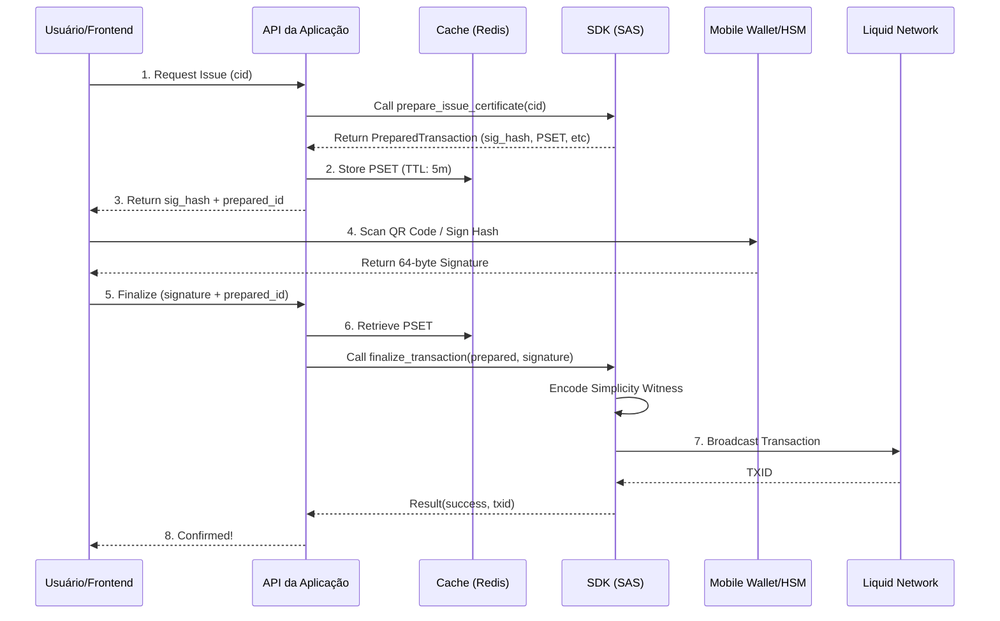

# Assinatura Externa e Offline (External Signing)

> **SDK Version**: v0.6.0+  
> **Protocol**: SAS v1.0  
> **Status**: Production Ready

Este guia descreve como utilizar o SDK para processos de assinatura onde as chaves privadas **não estão acessíveis ao servidor** (ex: Hardware Wallets, Mobile Apps, Multisig ou HSMs).

---

## 1. Arquitetura do Fluxo

Diferente do modo automático, onde o SDK assina e envia a transação em um único passo, o modo de assinatura externa divide a operação em três fases distintas: **Prepare**, **Sign** e **Finalize**.

### Diagrama de Sequência (Transação Custodiada/Mobile)



---

## 2. Implementação no SDK

### Fase 1: Prepare
O SDK constrói a transação, aplica as Covenants (travas do contrato) e calcula o `sig_hash` exato que o Simplicity exigirá na rede.

```python
from sdk import SAPClient

client = SAPClient.from_config("secrets.json")

# Prepara a emissão de um certificado
prepared = client.prepare_issue_certificate(
    cid="QmYwAPJzv5...",
    issuer="delegate"
)

print(f"Hash para assinar: {prepared.sig_hash}")
print(f"Papel do assinante: {prepared.signer_role}")
# prepared.sig_hash_bytes está pronto para ser enviado para a wallet
```

### Fase 2: Sign (Externo)
Nesta fase, você utiliza qualquer ferramenta que suporte assinaturas **Schnorr (BIP-340)**.

#### Exemplo A: Mobile App (QR Code)
Se você estiver construindo um app mobile, o payload do QR Code deve conter:
```json
{
  "protocol": "sas-v1",
  "action": "sign_hash",
  "hash": "a1b2c3d4...",
  "role": "delegate",
  "network": "liquid-testnet"
}
```

#### Exemplo B: HSM / KMS (AWS KMS, Google Cloud HSM)
```python
# Pseudo-código para integração com KMS
signature = kms_client.sign(
    KeyId=os.environ["KMS_KEY_ID"],
    Message=prepared.sig_hash_bytes,
    MessageType='RAW',
    SigningAlgorithm='RSASSA_PSS_SHA_256' # Ajustar para o algoritmo da wallet
)
```

### Fase 3: Finalize
Com a assinatura em mãos (64 bytes), o SDK injeta os dados no `PSET`, gera o `Witness` do Simplicity e faz o broadcast.

```python
result = client.finalize_transaction(
    prepared=prepared,
    signature=signature_bytes, # 64 bytes
    broadcast=True
)

if result.success:
    print(f"Sucesso! TXID: {result.txid}")
```

---

## 3. Guia de Integração para Backend (API)

Para uma implementação segura e escalável, siga estas recomendações:

### 1. Persistência (PSET Cache)
O objeto `PreparedTransaction` deve ser persistido entre o Prepare e o Finalize. **Nunca confie no PSET enviado pelo frontend**; sempre recupere-o do seu cache seguro (Redis ou DB).

### 2. Expiração (TTL)
As transações preparadas devem ter um tempo de vida curto (ex: 5 a 10 minutos). Isso evita que UTXOs fiquem "presos" em transações que nunca foram assinadas.

### 3. Validação de Idempotência
Utilize o `sig_hash` como chave para garantir que a mesma transação não seja finalizada duas vezes.

---

## 4. Security Hardening (Boas Práticas)

Para ambientes de alta segurança:

1.  **Verificação de Pubkey**: Antes de chamar `finalize_transaction`, valide se o `prepared.required_pubkey` corresponde à chave que você espera que assine aquela operação.
2.  **Transparência para o Usuário**: Ao exibir o `sig_hash` para assinatura, mostre também os detalhes contidos em `prepared.details` (endereço do vault, CID, role). O usuário deve saber exatamente o que está assinando.
3.  **Sanitização de Assinatura**: O SDK valida o tamanho da assinatura (64 bytes), mas a API deve garantir que a entrada seja um hexadecimal válido de 128 caracteres antes de converter para bytes.
4.  **Isolamento de Erros**: Se o `broadcast` falhar por "mempool conflict", limpe o cache da transação preparada e peça ao usuário para gerar uma nova (o estado dos UTXOs pode ter mudado).

---

## 5. Referência de Dados

### Objeto PreparedTransaction
| Campo | Descrição |
| :--- | :--- |
| `sig_hash` | Hash SHA256 do PSET que precisa da assinatura Schnorr. |
| `pset` | Transação completa em formato Base64 (contém covenants). |
| `input_index` | Qual entrada (vin) do PSET deve ser assinada. |
| `witness_template` | Instrução interna para o `WitnessEncoder`. |
| `details` | Dicionário com metadados legíveis (CID, balance, etc). |

---

## 6. Próximos Passos
Para ver uma implementação completa em código, veja o diretório `/examples/api_reference`.
