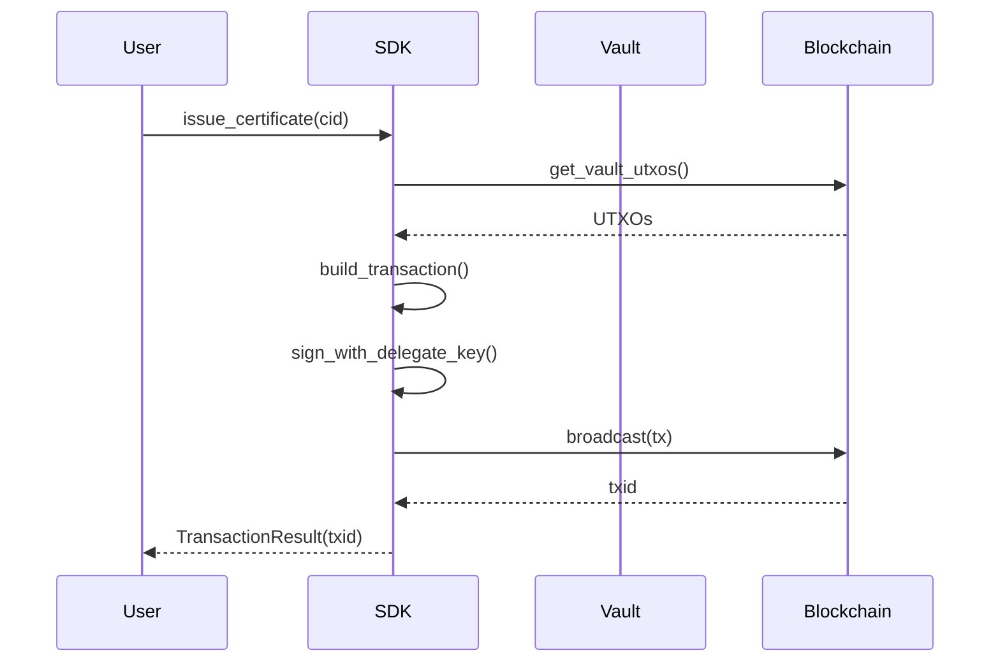
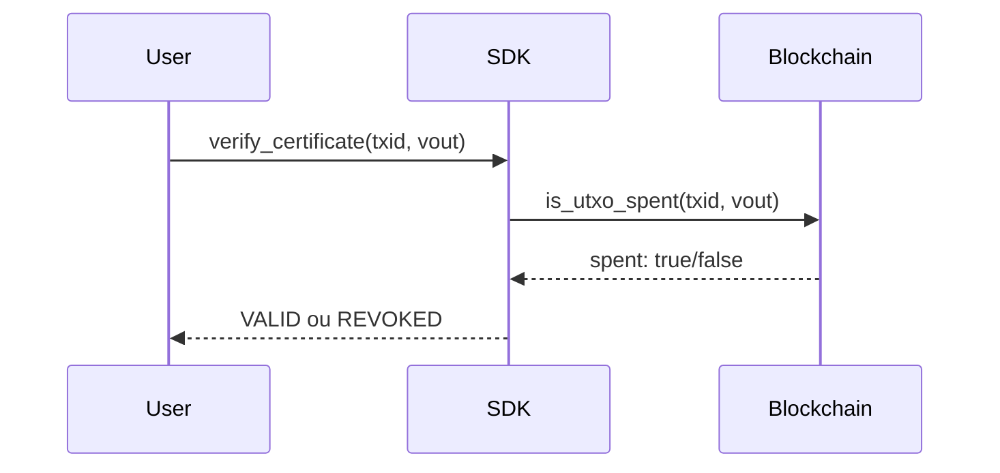

# SAP SDK - Documentação da API

Guia completo de todas as funções disponíveis no SDK de Abstração do Simplicity Attestation Protocol.

---

## Índice

1. [Início Rápido](#início-rápido)
2. [SAPClient](#sapclient)
3. [Modelos de Dados](#modelos-de-dados)
4. [Componentes Internos](#componentes-internos)
5. [Protocolo SAP](#protocolo-sap)

---

## Início Rápido

### Instalação

```bash
# Clone o repositório
git clone https://github.com/seu-repo/sap-sdk.git

# Instale dependências
pip install embit requests
```

### Uso Básico

```python
from sdk import SAPClient

# Inicializar a partir do arquivo de configuração
client = SAPClient.from_config("secrets.json")

# Emitir um certificado
result = client.issue_certificate(cid="QmYwAPJzv5CZsnA625s3Xf2nemtYgPpHdWEz79ojWnPbdG")
print(f"Certificado emitido: {result.txid}")

# Verificar um certificado
status = client.verify_certificate(txid="abc123...", vout=1)
print(f"Status: {status}")  # VALID ou REVOKED

# Revogar um certificado
result = client.revoke_certificate(txid="abc123...", vout=1)
print(f"Revogado: {result.success}")
```

---

## SAPClient

A classe principal do SDK. Fornece operações de alto nível em uma única linha.

### Construtores

#### `SAPClient.from_config(config_path: str) -> SAPClient`

Cria um cliente a partir do arquivo `secrets.json`.

```python
client = SAPClient.from_config("secrets.json")
```

| Parâmetro | Tipo | Descrição |
|-----------|------|-----------|
| `config_path` | `str` | Caminho para o arquivo secrets.json |

**Retorna:** Instância configurada do `SAPClient`

---

### Operações do Vault

#### `get_vault() -> Vault`

Obtém o estado atual do vault (cofre de delegação).

```python
vault = client.get_vault()
print(f"Endereço: {vault.address}")
print(f"Saldo: {vault.balance} sats")
print(f"Pode emitir: {vault.can_issue}")
```

**Retorna:** Objeto `Vault` com:
- `address`: Endereço do vault
- `balance`: Saldo total em satoshis
- `utxos`: Lista de UTXOs disponíveis
- `can_issue`: Se tem fundos suficientes para emitir

---

#### `get_vault_balance() -> int`

Obtém o saldo do vault em satoshis.

```python
balance = client.get_vault_balance()
print(f"Saldo: {balance} sats")
```

**Retorna:** Saldo em satoshis

---

#### `drain_vault(recipient: str, broadcast: bool = True) -> TransactionResult`

Drena o vault (somente Admin). Esvazia o vault enviando todos os fundos para um endereço, desativando efetivamente o Delegate.

```python
result = client.drain_vault(recipient="tex1qyh6tyhspd9w8jhqee8a2uzvyk9lnwp2n8ssur0")
print(f"Vault drenado: {result.txid}")
```

| Parâmetro | Tipo | Padrão | Descrição |
|-----------|------|--------|-----------|
| `recipient` | `str` | - | Endereço para receber os fundos |
| `broadcast` | `bool` | `True` | Se deve transmitir imediatamente |

**Retorna:** `TransactionResult` com `txid` ou `error`

---

### Operações de Certificado

#### `issue_certificate(cid: str, issuer: str = "delegate", broadcast: bool = True) -> TransactionResult`

Emite um novo certificado a partir do vault.

```python
# Como Delegate (padrão)
result = client.issue_certificate(cid="QmYwAPJzv5CZsnA625s3Xf2nemtYgPpHdWEz79ojWnPbdG")

# Como Admin
result = client.issue_certificate(
    cid="QmYwAPJzv5CZsnA625s3Xf2nemtYgPpHdWEz79ojWnPbdG",
    issuer="admin"
)

if result.success:
    print(f"Certificado emitido: {result.txid}")
    print(f"Explorer: {result.explorer_url}")
else:
    print(f"Erro: {result.error}")
```

| Parâmetro | Tipo | Padrão | Descrição |
|-----------|------|--------|-----------|
| `cid` | `str` | - | IPFS CID ou hash do conteúdo |
| `issuer` | `str` | `"delegate"` | `"admin"` ou `"delegate"` |
| `broadcast` | `bool` | `True` | Se deve transmitir imediatamente |

**Retorna:** `TransactionResult` com:
- `success`: Se a operação foi bem-sucedida
- `txid`: ID da transação (se sucesso)
- `explorer_url`: URL do explorador Blockstream
- `error`: Mensagem de erro (se falhou)

---

#### `verify_certificate(txid: str, vout: int = 1) -> CertificateStatus`

Verifica se um certificado é válido (UTXO não gasto).

```python
status = client.verify_certificate(txid="abc123...", vout=1)

if status == CertificateStatus.VALID:
    print("✓ Certificado válido")
elif status == CertificateStatus.REVOKED:
    print("✗ Certificado revogado")
```

| Parâmetro | Tipo | Padrão | Descrição |
|-----------|------|--------|-----------|
| `txid` | `str` | - | ID da transação do certificado |
| `vout` | `int` | `1` | Índice da saída (padrão 1) |

**Retorna:** `CertificateStatus`:
- `VALID`: Certificado ativo (UTXO não gasto)
- `REVOKED`: Certificado revogado (UTXO gasto)
- `UNKNOWN`: Status desconhecido

---

#### `revoke_certificate(txid: str, vout: int = 1, revoker: str = "admin", recipient: str = None, broadcast: bool = True) -> TransactionResult`

Revoga um certificado gastando seu UTXO.

```python
# Revogar como Admin (padrão)
result = client.revoke_certificate(txid="abc123...", vout=1)

# Revogar como Delegate
result = client.revoke_certificate(
    txid="abc123...",
    vout=1,
    revoker="delegate"
)

# Revogar e enviar fundos para um endereço
result = client.revoke_certificate(
    txid="abc123...",
    vout=1,
    recipient="tex1qyh6tyhspd9w8jhqee8a2uzvyk9lnwp2n8ssur0"
)
```

| Parâmetro | Tipo | Padrão | Descrição |
|-----------|------|--------|-----------|
| `txid` | `str` | - | ID da transação do certificado |
| `vout` | `int` | `1` | Índice da saída |
| `revoker` | `str` | `"admin"` | `"admin"` ou `"delegate"` |
| `recipient` | `str` | `None` | Endereço para receber fundos (queima como taxa se None) |
| `broadcast` | `bool` | `True` | Se deve transmitir imediatamente |

**Retorna:** `TransactionResult`

---

#### `get_certificate(txid: str, vout: int = 1) -> Optional[Certificate]`

Obtém detalhes completos de um certificado.

```python
cert = client.get_certificate(txid="abc123...", vout=1)

if cert:
    print(f"CID: {cert.cid}")
    print(f"Status: {cert.status}")
    print(f"Emitido no bloco: {cert.issued_at}")
    print(f"Válido: {cert.is_valid}")
```

**Retorna:** Objeto `Certificate` ou `None`

---

#### `list_certificates() -> List[Certificate]`

Lista todos os certificados válidos (UTXOs não gastos).

```python
certificates = client.list_certificates()

for cert in certificates:
    print(f"- {cert.txid}:{cert.vout}")
    print(f"  CID: {cert.cid}")
    print(f"  Status: {cert.status}")
```

**Retorna:** Lista de objetos `Certificate`

---

## Modelos de Dados

### Certificate

Representa um certificado SAP.

```python
@dataclass
class Certificate:
    txid: str               # ID da transação
    vout: int               # Índice da saída
    cid: str                # IPFS CID ou hash
    status: CertificateStatus
    issued_at: Optional[int]  # Altura do bloco
    revoked_at: Optional[int] # Altura do bloco (se revogado)
    value: int = 546        # Valor em satoshis
```

**Propriedades:**
- `outpoint`: Retorna `"txid:vout"`
- `is_valid`: Retorna `True` se status é VALID

---

### Vault

Representa o vault de delegação.

```python
@dataclass
class Vault:
    address: str            # Endereço do vault
    script_pubkey: str
    cmr: str
    program: str
    balance: int = 0        # Saldo em satoshis
    utxos: List[UTXO]       # UTXOs disponíveis
```

**Propriedades:**
- `can_issue`: `True` se tem fundos suficientes (≥1046 sats)
- `available_utxo`: Primeiro UTXO disponível

---

### TransactionResult

Resultado de uma operação de transação.

```python
@dataclass
class TransactionResult:
    success: bool           # Se foi bem-sucedido
    txid: Optional[str]     # ID da transação
    raw_hex: Optional[str]  # Hex da transação bruta
    error: Optional[str]    # Mensagem de erro
```

**Propriedades:**
- `explorer_url`: URL do explorador Blockstream

---

### CertificateStatus

Enum para status do certificado.

```python
class CertificateStatus(Enum):
    VALID = "valid"      # UTXO não gasto
    REVOKED = "revoked"  # UTXO gasto
    UNKNOWN = "unknown"  # Status desconhecido
```

---

### UTXO

Saída de transação não gasta.

```python
@dataclass
class UTXO:
    txid: str
    vout: int
    value: int  # satoshis
```

---

## Componentes Internos

### WitnessEncoder

Codifica witnesses no nível de bits para os caminhos de gasto do Simplicity.

```python
from sdk.core.witness import WitnessEncoder

# Witness para Admin drenar vault
witness = WitnessEncoder.vault_admin_unconditional(signature)

# Witness para Admin emitir certificado
witness = WitnessEncoder.vault_admin_issue(signature)

# Witness para Delegate emitir certificado
witness = WitnessEncoder.vault_delegate_issue(signature)

# Witness para Admin revogar certificado
witness = WitnessEncoder.certificate_admin(signature)

# Witness para Delegate revogar certificado
witness = WitnessEncoder.certificate_delegate(signature)
```

---

### HalSimplicity

Wrapper para a CLI hal-simplicity.

```python
from sdk.infra.hal import HalSimplicity

hal = HalSimplicity(binary_path="/path/to/hal-simplicity")

# Criar PSET
pset = hal.pset_create(inputs, outputs)

# Atualizar input
pset = hal.pset_update_input(pset, index, script_pubkey, asset, amount, cmr, internal_key)

# Executar programa (obter sig_all_hash)
result = hal.pset_run(pset, index, program, witness)
sig_hash = result.sig_all_hash

# Finalizar PSET
pset = hal.pset_finalize(pset, index, program, witness)

# Extrair transação
tx_hex = hal.pset_extract(pset)
```

---

### BlockstreamAPI

Cliente para a API Blockstream Esplora.

```python
from sdk.infra.api import BlockstreamAPI

api = BlockstreamAPI(network="testnet")

# Obter UTXOs
utxos = api.get_utxos(address)

# Obter saldo
balance = api.get_balance(address)

# Transmitir transação
result = api.broadcast(tx_hex)

# Verificar se UTXO foi gasto
is_spent = api.is_utxo_spent(txid, vout)
```

---

### KeyManager

Gerenciamento de chaves e assinaturas Schnorr.

```python
from sdk.infra.keys import KeyManager

key = KeyManager(private_key="...")

# Obter chave pública
pubkey = key.public_key

# Assinar hash
signature = key.sign_hash(sig_all_hash)  # Retorna 64 bytes
```

---

## Protocolo SAP

### SAPProtocol

Codificador/decodificador do protocolo SAP para OP_RETURN.

```python
from sdk.protocols.sap import SAPProtocol

# Codificar atestado
payload = SAPProtocol.encode_attest(cid="QmYwAP...")
# Resultado: "5341500101516d59774150..."

# Codificar revogação
payload = SAPProtocol.encode_revoke(txid="abc...", vout=1)

# Decodificar payload
sap = SAPProtocol.decode(data_bytes)
if isinstance(sap, SAPAttest):
    print(f"CID: {sap.cid}")
```

### Formato OP_RETURN

```
┌───────┬─────────┬──────────┬─────────────────────────┐
│  TAG  │ VERSION │   TYPE   │        PAYLOAD          │
│ "SAP" │  0x01   │  0x01    │   CID (variável)        │
├───────┼─────────┼──────────┼─────────────────────────┤
│3 bytes│ 1 byte  │  1 byte  │       variável          │
└───────┴─────────┴──────────┴─────────────────────────┘
```

| TYPE | Valor | Descrição |
|------|-------|-----------|
| ATTEST | `0x01` | Emissão de certificado |
| REVOKE | `0x02` | Revogação de certificado |
| UPDATE | `0x03` | Atualização de metadados |

---

## Fluxo de Operações

### Emitir Certificado



### Verificar Certificado



---

## Exemplos Completos

### Fluxo Completo de Certificação

```python
from sdk import SAPClient

# 1. Inicializar
client = SAPClient.from_config("secrets.json")

# 2. Verificar vault
vault = client.get_vault()
if not vault.can_issue:
    print(f"Financie o vault: {vault.address}")
    exit()

# 3. Emitir certificado
result = client.issue_certificate(
    cid="QmYwAPJzv5CZsnA625s3Xf2nemtYgPpHdWEz79ojWnPbdG"
)

if result.success:
    print(f"✓ Certificado emitido!")
    print(f"  TXID: {result.txid}")
    print(f"  Explorer: {result.explorer_url}")
    
    # 4. Verificar (após confirmação)
    status = client.verify_certificate(result.txid, 1)
    print(f"  Status: {status}")
else:
    print(f"✗ Erro: {result.error}")
```

### Revogar Todos os Certificados

```python
from sdk import SAPClient

client = SAPClient.from_config("secrets.json")

# Listar todos os certificados válidos
certs = client.list_certificates()
print(f"Encontrados {len(certs)} certificados válidos")

# Revogar cada um
for cert in certs:
    result = client.revoke_certificate(cert.txid, cert.vout)
    if result.success:
        print(f"✓ Revogado: {cert.txid}:{cert.vout}")
    else:
        print(f"✗ Erro: {result.error}")
```

---

*SAP SDK - Documentação v1.0*
